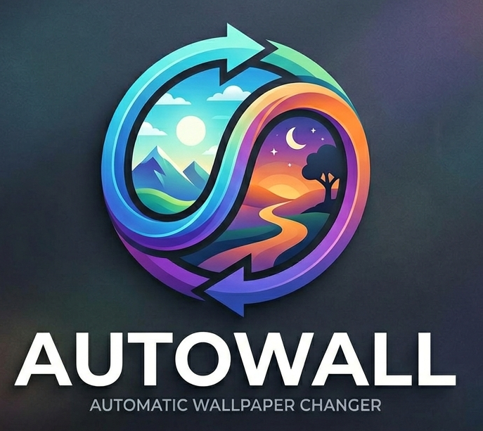

<p align="center">
  
</p>

# Autowall

A Windows desktop wallpaper manager with automatic scheduling, Unsplash fetching, a full taskbar GUI, and a system tray icon.

---

## Quick Start

**Download the pre-built Windows executable** (no Python required)

→ [**Download Autowall.exe** from Releases](https://github.com/Ailurophile47/Autowall/releases/latest)

### Setup (3 steps)

1. **Download** `Autowall.exe` from the latest release page
2. **Run it** — folders (`Inbox/`, `Favorites/`, `config/`) are created automatically
3. **Add your key** — Open Settings (⚙ icon) and paste your [Unsplash API Access Key](https://unsplash.com/developers)

**That's it!** No installation, no Python required. To auto-start with Windows, enable "Start automatically with Windows" in Settings.

---

## Requirements

- **Windows 10 or 11**
- **Internet connection** (for Unsplash fetching)
- **Unsplash API Access Key** — Get a free one at [unsplash.com/developers](https://unsplash.com/developers)

For the exe version: nothing else needed.

---

## Features

- **Auto wallpaper rotation** — changes wallpaper on a set interval (hourly, 6 h, 12 h, daily) or at a fixed time of day
- **Unsplash integration** — fetches high-resolution wallpapers by keyword category; guarantees at least one new image per fetch
- **Dark dashboard GUI** — taskbar-visible app window with hero preview, 4-column library grid, tab switching (All / Favorites / Recent)
- **System tray** — runs silently in the background; change wallpaper, fetch new ones, pause rotation, open viewer, or exit from the tray
- **Image reviewer** — swipe-style review window to like, favorite, or discard images; includes the 5 most recent wallpapers alongside unreviewed ones
- **Favorites system** — favorited images are moved to a dedicated folder and prioritized
- **No-repeat cycle** — wallpapers rotate without repeating until the full pool is exhausted, then the cycle resets
- **Minimum resolution filter** — download only 1080p, 2K, or 4K images (configurable)
- **Scheduled time support** — optionally set an exact HH:MM time (24-hr) for the daily wallpaper change
- **Autostart with Windows** — optional registry entry so Autowall launches at login
- **Close to tray** — closing the window keeps the app running; only the tray Exit button fully quits

---

## Running from Source

If you prefer to run the app directly from Python (developer mode):

### Requirements
- Python 3.9 or later
- Unsplash API Access Key

### Installation

1. **Clone the repository**

   ```powershell
   git clone https://github.com/Ailurophile47/Autowall.git
   cd Autowall
   ```

2. **Install dependencies**

   ```powershell
   py -m pip install requests pillow pystray
   ```

3. **Run the app**

   ```powershell
   py main.py
   ```

4. **Add your Unsplash API Key**

   Open Settings (⚙ icon) and paste your key. It's stored in `config/config.json` (git-ignored).

---

## Building the Exe Yourself

To create your own `dist/Autowall.exe`:

### Requirements
- Python 3.9 or later
- PyInstaller and Pillow

### Build Steps

1. **Install build tools**

   ```powershell
   py -m pip install pyinstaller pillow
   ```

2. **Ensure your logo is ready**

   Place your `assets/logo.png` (recommended: 512×512 or larger).

3. **Run the build script**

   ```powershell
   py build_exe.py
   ```

   This converts `logo.png` → `assets/logo.ico` and packages the app via PyInstaller.

4. **Find your exe**

   ```
   dist/Autowall.exe
   ```

   This is fully self-contained — copy it anywhere and run.

5. **Distribute or keep locally**

   - **Share** — Upload to GitHub Releases or share the exe file
   - **Keep local** — Run directly or schedule in Task Scheduler

---

## Project Structure

```
Autowall/
├── main.py                  # Entry point — starts background loop, tray, and main window
├── build_exe.py             # Builds dist/Autowall.exe via PyInstaller
├── assets/
│   └── logo.png             # App logo (logo.ico generated by build_exe.py, gitignored)
├── core/
│   ├── manager.py           # Config/metadata I/O, folder setup, candidate filtering
│   ├── downloader.py        # Unsplash API fetch with guaranteed-minimum logic
│   └── wallpaper.py         # Windows wallpaper setter via ctypes + winreg
├── ui/
│   ├── app_window.py        # Main taskbar window (hero card + library grid)
│   ├── viewer.py            # Image review window (like / favorite / dislike)
│   ├── settings.py          # Settings window (interval, schedule, categories, API key)
│   └── tray.py              # System tray icon and menu (pystray)
├── config/
│   └── config.json          # User settings (git-ignored, contains API key)
├── Inbox/                   # Downloaded wallpapers (git-ignored)
├── Favorites/               # Favorited wallpapers (git-ignored)
└── metadata.json            # Image state tracking (git-ignored)
```

---

## How It Works

### Startup

`main.py` runs three components simultaneously:

| Component | Thread | Role |
|---|---|---|
| Background loop | Daemon thread | Checks every 60 s whether to change the wallpaper or fetch new ones |
| Tray icon | Daemon thread | System tray menu for quick actions |
| Main window | Main thread | Full GUI; blocks until the process exits |

### Background loop

Every 60 seconds the loop checks:

- **Wallpaper change** — if the configured interval has elapsed, or if the scheduled HH:MM matches the current time (once per day), it calls `wallpaper.set_next()` and refreshes the GUI grid.
- **Daily fetch** — if 24 hours have passed since the last fetch, it downloads a new batch from Unsplash and registers the images.

### Unsplash fetching

`downloader.fetch()` shuffles the configured categories and tries each one until at least one image is successfully downloaded. This guarantees a result even if the first query returns only duplicates or images that fail the resolution filter.

### Wallpaper rotation

`wallpaper.set_next()` picks a random candidate from `metadata.json` that has not been used recently. Once all images are used, the cycle resets. A rolling "recent" window (last 5) prevents the same image appearing back-to-back across resets.

### Metadata

`metadata.json` tracks every image by its MD5 file hash:

```json
{
  "abc123...": {
    "path": "C:/...Inbox/photo.jpg",
    "date": "2025-01-01T12:00:00",
    "liked": false,
    "favorite": false,
    "reviewed": false,
    "used_as_wallpaper": true,
    "last_set": "2025-01-02T08:00:00"
  },
  "__recent__": ["abc123...", "def456..."]
}
```

---

## Settings Reference

| Setting | Description |
|---|---|
| Change Interval | How often to auto-rotate (1 h / 6 h / 12 h / 24 h) |
| Scheduled Change Time | Optional fixed HH:MM (24-hr) for the daily change |
| Minimum Resolution | Filter downloads to 1080p / 2K / 4K |
| Categories | Unsplash search keywords (nature, space, cyberpunk, etc.) |
| Favorites Only Mode | Rotate only through your favorited images |
| Start with Windows | Adds/removes the app from the Windows registry autostart |
| Unsplash API Key | Your Unsplash Access Key (stored locally, never committed) |

---

## GUI Overview

### Main window

- **Top bar** — logo, tab switcher (Library / Favorites / Recent), fetch button (⟳), reviewer shortcut (◱), settings (⚙)
- **Hero card** — large preview of the currently active wallpaper with Like, Fav, Set Now, and Delete actions
- **Library grid** — 4-column thumbnail grid; left-click to set as wallpaper, right-click for full context menu
- Resizes responsively; closing the window sends Autowall to the tray

### Viewer

Opened from the tray or the ◱ button. Shows unreviewed images and the 5 most recent wallpapers (marked `[Recent]`). Actions: Like (`L`), Favorite (`F`), Skip (`S`), Discard (`D`).

### Tray menu

| Item | Action |
|---|---|
| Show Window | Restore the main window |
| Change Wallpaper Now | Immediately rotate to the next wallpaper |
| Fetch New Wallpapers | Download a fresh batch from Unsplash |
| Open Viewer | Launch the image reviewer |
| Pause Auto Mode | Suspend the background rotation loop |
| Favorites Only | Toggle favorites-only rotation |
| Settings | Open the settings window |
| Exit | Fully quit Autowall |

---

## Wallpaper Styles

Configurable via `config.json` (`wallpaper_style` key). Options: `Fill`, `Fit`, `Stretch`, `Center`, `Span`, `Tile`. Default is `Fill`.

---

## Troubleshooting

**No wallpapers appear on first launch**
Ensure your Unsplash API key is set in Settings. Without a key, fetching is skipped.

**"No new wallpapers fetched" notification**
All images returned by the API were either already downloaded or below the minimum resolution. Try adding more categories in Settings.

**Autowall doesn't start with Windows**
Enable "Start automatically with Windows" in Settings and click Save. This writes an entry to `HKCU\Software\Microsoft\Windows\CurrentVersion\Run`.

**Import errors on launch**
Run `py -m pip install requests pillow pystray` to install missing dependencies.

---

## Notes

- `config/config.json` and `metadata.json` are git-ignored — your API key and local image paths are never committed.
- `Inbox/` and `Favorites/` are also git-ignored — images are fetched fresh on each installation.
- The app uses only the Unsplash **Access Key** (not the Secret Key).
